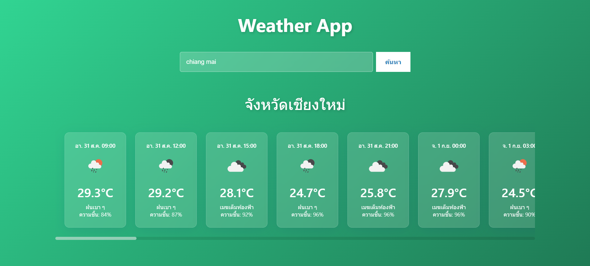
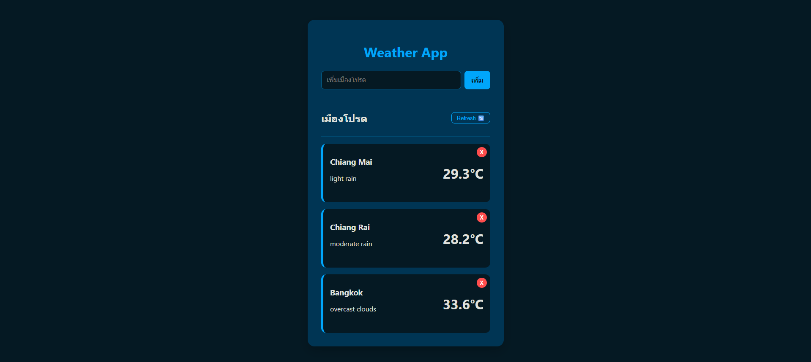

## PART 1 LAB-07:Frontend Development with Modern JavaScript (ES6+)
เว็บแสดงผลสภาพอากาศ

## ผู้จัดทำ
 - นายเจษฎา บุญทา รหัส 66543206063-0

## เอกสารประกอบ
เอกสาร : [Google Doc](https://docs.google.com/document/d/1ap0rHQ2AH5PHTuLh2gs7P3C2Rbg2UblFOkXzaGE-lAE/edit?usp=sharing)

Demo : [Click Here](https://jessadaid.github.io/my-weather-app/)

Preview Part 1 : 

Preview Part 2 : 
